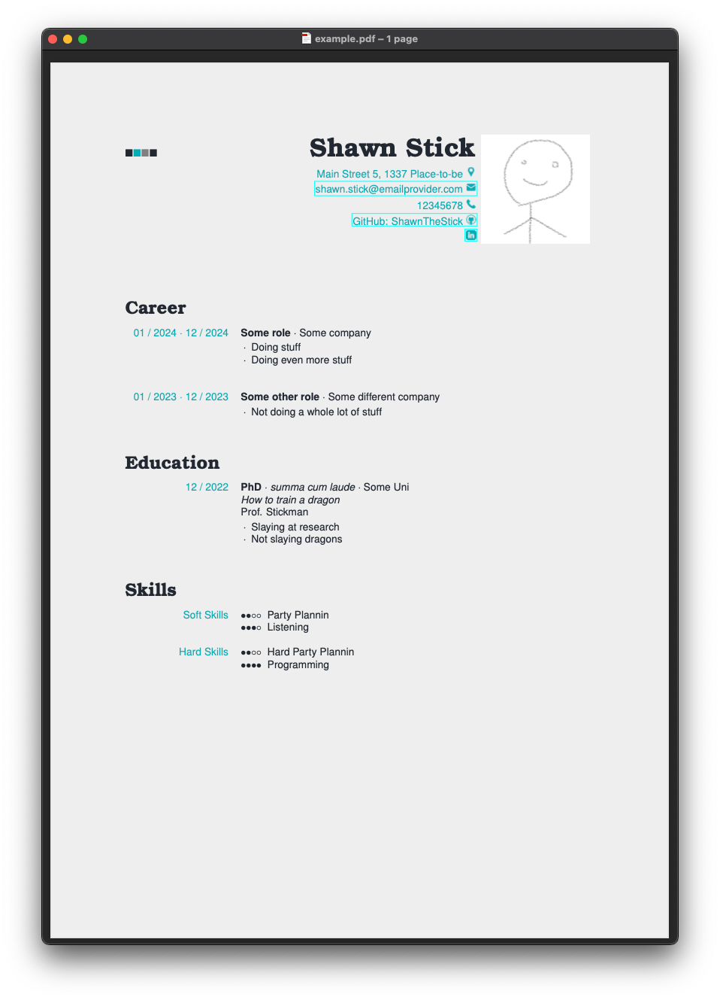

# LaTeX-CV-2

This repository contains an alternative solution to GUI-based CV creation tools.

The user specifies the contents of the CV using a YAML file. This file gets read by a Python script
to manipulate a LaTeX template and afterwards the template gets compiled.

Alternatively, if you cannot be bothered with Python and are somewhat familiar with LaTeX, the template `src/CV_template.tex` could be used by itself.

*The code in this repository builds upon the work done in [latex-cv](https://github.com/KainAber/latex-cv),
making a tradeoff by increasing the complexity of the template and config while enhancing its flexibility to support additional templates.*

## Example CV

```yaml
template: modern

personal info:
    name: Shawn Stick
    photo: shawn.png
    address: Main Street 5, 1337 Place-to-be
    ...

vita:
    - vita section:
        title: Career
        contents:
            vita item:
                -   title: Some role
                    start date: 01 / 2024
                    end date: 12 / 2024
                    organisation: Some company
                    description:
                        description items:
                            - item: Doing stuff
                            - item: Doing even more stuff
                ...

qualities:
    -   title: Skills
        contents:
            quality section:
            -   section name: Soft Skills
                items:
                    - quality : Party Plannin
                      level: 0.6
                    - quality: Listening
                      level: 0.75
            ...
colors:
    second: "00ADB5"
    accent: "999999"
    icons: "00ADB5"
    ,,,

geometry:
    left side ratio: .33
    ...

language: english

```
<div align="center">


</div>

## Overview of Repository

```shell
├── input                     # input folder containing base examples
│   ├── example.yaml            # YAML file for building an example CV
│   └── pic.png                 # image needed for the example
├── src                       # folder containing source codes, LaTeX templates, etc
│   ├── img                     # folder of icons embedded into the template
│   ├── templates               # folder of LaTeX templates
│   ├── io_utils.py             # Python module which provides I/O utility
│   └── latex_cv.py             # Python module which provides template transformations
├── output                    # default output folder
├── main.py                   # entry point to the python program flow
├── config.yaml               # configuration file for input and output folders
├── README.md                 # read-me file
└── requirements.txt          # requirements for running and developing the code
```

## Quickstart

Make sure the following is installed on your machine:
* LaTeX (incl. pdflatex and [latexmk](https://mg.readthedocs.io/latexmk.html))
* Python (any version of Python 3 should suffice)

If the above programs are installed, follow these steps:
1. Clone this repository via
    ```shell
   git clone https://github.com/KainAber/latex-cv-2.git
    ```
3. Optional: Configure a virtual environment for this project
3. Navigate inside the repository and install the requirements
    ```shell
    cd latex-cv
    pip install -r requirements.txt
    ```
4. Run `main.py`

This last step generates a `.tex` file and then calls `subprocess.run` to execute a `latexmk` command compiling that `.tex` file.

Both the `.tex` and the `.pdf` file are created inside `output` based on the `.yaml` file inside `input` which was updated last (`example.yaml` in this case).

To create your own CV, simply create a `.yaml` file inside `input` which mimics the contents of the example `.yaml` files in `input` and re-run `main.py`.

## Customizations

In order to not have to work inside the repository folder, the file `config.yaml` affords the capability to change the the input folder (which is used to select the CV contents `.yaml` file) and the output folder (used for exporting `.tex` and `.pdf` files).

If you additionally create an alias in your shell configuration for the execution of `main.py`, you can essentially use this repository from anywhere inside your system.`

## Future Updates

* More socials (suggestions welcome)
* More controls (e.g. fonts)
* More templates

## Acknowledgements

* The icons are from [flaticon.com](https://www.flaticon.com/de/):
  * [address](https://www.flaticon.com/free-icon/stift_484167) by [Those Icons](https://www.flaticon.com/authors/those-icons)
  * [email](https://www.flaticon.com/free-icon/email_3059474) by [Ilham Fitrotul Hayat](https://www.flaticon.com/authors/ilham-fitrotul-hayat)
  * [github](https://www.flaticon.com/free-icon/social_16021236) by [iconsimple](https://www.flaticon.com/authors/iconsimple)
  * [linkedin](https://www.flaticon.com/free-icon/linkedin_3536569) by [riajulislam](https://www.flaticon.com/authors/riajulislam)
  * [phone](https://www.flaticon.com/free-icon/call_16703465) by [meaicon](https://www.flaticon.com/authors/meaicon)
* The `example.yaml` color scheme is from [colorhunt.co](https://colorhunt.co/palette/222831393e4600adb5eeeeee)
